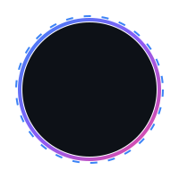

<!-- Capsule Render Header Banner -->

<!-- Dynamic Typing SVG Subtitle -->

<!-- Animated Avatar Image -->

  

  <!-- Visitor Counter -->
  

<!-- Social Connect Badges -->

  
  
  
  

---

## 📖 About Me & Journey

<b>⚡ Quick Introduction</b>

 

Hi! I'm **Utkarsh Tiwari**, a **Cloud & DevOps Engineer** passionate about building highly scalable, fault-tolerant cloud infrastructures and automated CI/CD pipelines. With solid foundations in programming languages like Java and C++, I enjoy bridging the gap between development and operations.

- 🔭 **Current Focus:** Enhancing my skills in Cloud Technologies (AWS & Azure) and DevOps automation workflows.
- 💡 **Interests:** System administration, infrastructure-as-code, Docker containerization, and solving complex DSA problems.
- 🎯 **Goal:** Design high-availability cloud solutions that simplify application deployment and monitoring.

<b>🏫 Training & Education</b>

 

**Cloud & DevOps | Summer Training at Lovely Professional University (LPU)**
* **Duration:** Jul 2025
* **Tech Stack:** Next.js, AWS (EC2, S3, VPC, IAM, CloudWatch), Linux, Git & GitHub, Docker
* **Overview:** 
  Designed and deployed scalable cloud infrastructure using AWS services, ensuring secure and high-availability environments. Built and configured VPC architectures with public and private subnets, implementing routing mechanisms, Internet Gateway, and security groups for controlled access. Deployed and managed EC2 instances with Linux, enabling efficient system operations and remote access. Integrated monitoring and alerting using CloudWatch to maintain system reliability and performance. Applied best practices in cloud security, resource optimization, and infrastructure management.

---

## 🛠️ Tech Stack & Skills

| Category | Technologies / Frameworks |
| :--- | :--- |
| **💻 Programming Languages** |     |
| **☁️ Cloud & DevOps** |       |
| **⚙️ Databases & Tools** |      |

---

## 🚀 Projects

<b>🔗 URL Shortener with Cloud Deployment</b>

 

* **Duration:** Mar 2026
* **Tech Stack:** AWS (EC2, S3), Node.js, Express.js, MongoDB, Git & GitHub, Linux
* **Key Achievements:**
  - Designed and deployed a scalable URL shortening service on AWS using EC2 and S3, ensuring high availability, secure access, and efficient cloud resource utilization.
  - Developed RESTful APIs for URL generation and redirection with optimized request handling, database indexing, and efficient MongoDB queries to reduce response latency.
  - Implemented monitoring, logging, and deployment best practices, including system health tracking, error handling, and version control workflows to improve reliability, maintainability, and production readiness.

<b>📈 Highly Available AWS Infrastructure with Auto Scaling & Monitoring</b>

 

* **Duration:** Nov 2025
* **Tech Stack:** AWS (EC2, VPC, Auto Scaling, Load Balancer, CloudWatch), Linux, Git & GitHub
* **Key Achievements:**
  - Designed and deployed a highly available cloud architecture across multiple Availability Zones using AWS VPC and Application Load Balancer, ensuring fault tolerance and reliable traffic distribution.
  - Configured Auto Scaling Groups with dynamic scaling policies to automatically adjust compute capacity based on workload demand, improving system scalability and performance.
  - Implemented monitoring and alerting using CloudWatch, including health checks and notifications, to proactively detect failures and maintain high system uptime.

---

## 🏆 Certifications & Achievements

<b>📜 Professional Certifications</b>

 

- 🔴 **Red Hat System Administration I (RH124)** — Red Hat
- ☁️ **AWS Cloud Technical Essentials** — Coursera
- ☁️ **AWS Cloud Practitioner Essentials** — Coursera
- 🏢 **Oracle Cloud Infrastructure Foundations Associate (2025)** — Oracle
- 🌐 **Bits and Bytes of Computer Networking** — Coursera

<b>🏅 Key Achievements</b>

 

- 🚀 **HackVerse 2024 Top 10:** Secured a top 10 position in HackVerse 2024 (national-level hackathon), demonstrating strong coding, teamwork, and rapid problem-solving abilities.
- 🤝 **Core Member of Untangle:** (Division of Student Organization) Organized and managed national hackathons, and contributed to technical sessions on cloud fundamentals, AWS, and DevOps practices.
- 🧠 **200+ LeetCode Solved:** Solved over 200+ Data Structures & Algorithms (DSA) problems, continuously sharpening optimization skills.

---

## 📊 Git & Coding Analytics

  <table border="0">
    <tr>
      <td align="center" valign="top">
        
      </td>
      <td align="center" valign="top">
        
      </td>
    </tr>
    <tr>
      <td align="center" valign="top">
        
      </td>
      <td align="center" valign="top">
        
      </td>
    </tr>
  </table>

---

## 👾 Contribution Arcade

  

